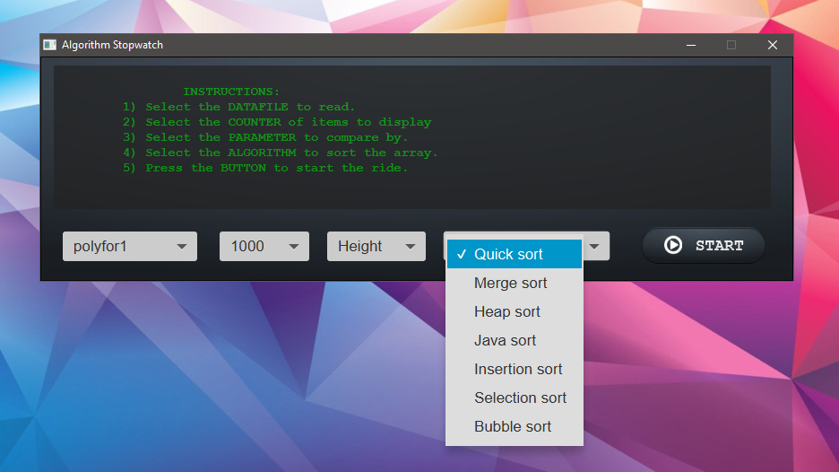

# Speedometer  
> A practical app to measure the real speed of 7 sorting algorithms.

## Instructions 
* Double click the Speedometer.jar and follow the instructions.

## Description
The data files represent a polygon shapes with height, area and volume. These will be read and converted into polygon objects.  
These objects implement the comparable interface in order to be ranked by my algorithm implementations.

### File Size 
* polyfor1 - 20,237 polygons.
* polyfor2 - 472,956 polygons.
* polyfor3 - 1,078,499 polygons.
* Files are only inside the jar**

### Algorithms 
1. Quick sort
2. Merge sort
3. Heap sort
4. Java sort\*\*
5. Insertion sort
6. Selection sort
7. Bubble sort
##### \*\* My implementation of the doSort() algorithm in Java JDK

## WARNING!
* Only use polyfor1 to measure: Insertion, Selection, Bubble, and Java sorts. 
The other files are too big for these algorithms. 
